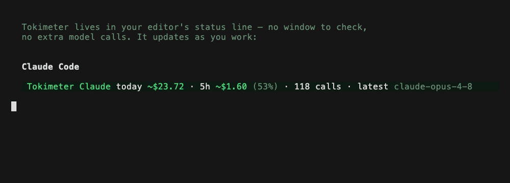
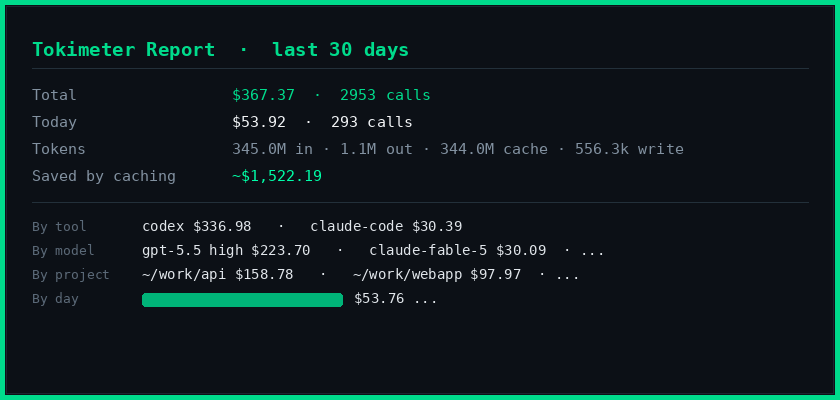

#  Tokimeter

**A private, local-first cost and budget meter for AI coding agents.**

See what **Claude Code**, **Codex CLI**,
**Grok Build**, **Hermes**, **opencode**, **Cline**, **Copilot CLI**, and
**Cursor CLI** actually use, what that usage would cost, and when it crosses a
budget you set. Local reports need no Tokimeter account, provider API key,
proxy, telemetry, prompt upload, or extra model call. Your data stays on your
machine unless you explicitly connect the optional hosted dashboard.

[](LICENSE)
[](#)

## Try one local report

Tokimeter requires [Node.js 18+](https://nodejs.org/en/download), which includes
`npm` and `npx`. If Terminal says `npm: command not found` or
`npx: command not found`, install Node.js first, then reopen Terminal.

```bash
npx tokimeter report
```

If Node.js/npm is already installed, `npx` downloads Tokimeter into npm's
temporary cache and runs one local report.
It does not permanently install the `tokimeter` command, start an ongoing
local meter, or enable optional dashboard syncing. No proxy, config, or API
keys are needed.
Tokimeter reads the usage metadata your tools already write locally (Claude
Code transcripts, Codex session logs) and shows you:

```
  Tokimeter Report · last 30 days
  ══════════════════════════════════════════════
  Total                     $367.37 · 2953 calls
  Today                     $53.92 · 293 calls
  Tokens                    345.0M in · 1.1M out · 344.0M cache read · 556.3k cache write
  Saved by prompt caching   ~$1522.19

  By tool                   codex $336.98 · claude-code $30.39
  By model                  gpt-5.5 high $223.70 · claude-fable-5 $30.09 · ...
  By project                ~/work/api $158.78 · ~/work/webapp $97.97 · ...
  By day                    ██████████████████ $53.76 ...
```

`--days=7`, `--tool claude|codex`, and `--json` are supported.

## Install Tokimeter

If the report is useful, install the command and its local HUDs:

```bash
npm install -g tokimeter && "$(npm prefix -g)/bin/tokimeter" setup --auto
```

Close and reopen your terminal when setup finishes. Then keep using `codex`,
`claude`, and your other supported tools normally; Tokimeter keeps its local
usage meter up to date and warns against budgets you choose. Calling the
executable by its full npm location makes the first run reliable even when
npm's global executable directory is not yet on zsh's `PATH`.

<p align="center">
  
</p>

<p align="center">
  
</p>

## Am I about to hit my limit?

Claude and ChatGPT subscriptions meter you on a **5-hour rolling window** plus a
weekly cap. Tokimeter shows your usage inside those exact windows:

```bash
tokimeter limits
```

```
  claude
    Last 5h:   ~$49.91 · 149 calls · 40.2M tokens · 83% of ~$60.00 budget  ⚠
    Last 7d:   ~$49.91 · 149 calls · 40.2M tokens

  codex
    Last 5h:   ~$11.96 · 109 calls · 22.6M tokens
    Last 7d:   ~$343.72 · 2927 calls · 682.2M tokens
    Vendor-reported (plus plan), as of 11:18:
      5h window:  48% used · resets in 1h 9m (13:08)
      Weekly:     73% used · resets in 4d 17h (Mon, Jul 13 05:46)
```

For Codex the numbers under "Vendor-reported" are OpenAI's own rate-limit
counters (Codex records them in its local session logs), including the exact
reset times, no guessing. Claude Code doesn't record any rate-limit telemetry
locally, so for Claude Tokimeter sticks to the honest rolling windows instead
of inventing reset times.

Set budgets once (`tokimeter config set budget.claude5h 60`, `budget.daily 50`,
`budget.weekly 200`) and get warnings in the CLI **and** in Claude Code's own
status line:

```
Tokimeter Claude today ~$48.16 · 5h ~$48.16 (80% ⚠) / 178 calls · latest claude-fable-5
```

Per-session budgets work too, for "warn me after $2 or 30 minutes in one
session":

```bash
tokimeter config set budget.session.cost 2
tokimeter config set budget.session.minutes 30
```

The Claude status line appends `session ~$2.10 ⚠ over $2.00 session budget`
and the Codex overlay shows the same warning in place. Warnings only, and
nothing is ever blocked or interrupted.

## Ongoing local meter after setup

Tokimeter adds live per-call usage accounting, budgets, a local watch feed, and a
status-line HUD that shows spend and 5-hour-window headroom **inside your
editor** — it warns you in place before you hit the wall, and never makes an
extra model call.

```bash
tokimeter watch --tool claude   # live per-tool feed
tokimeter latest --tool codex   # most recent calls
tokimeter doctor                # optional troubleshooting
tokimeter uninstall             # removes everything it installed
```

## More than a total

The same local data answers questions a running total can't, all computed on
your machine with no extra model calls:

```bash
tokimeter savings                  # routine work that could run cheaper (upper bound, never a nudge)
tokimeter agents                   # director vs subagent spend, broken out by agent type and skill
tokimeter plan                     # headroom left in each budget window + time-to-limit at your pace
tokimeter trace <session>          # one session explained: cost, models, delegation, cache
tokimeter report --orchestration   # projects where you run two tools together, and how spend splits
tokimeter report --md > report.md  # shareable Markdown report (also --html) for chargeback or records
tokimeter report --provider xai    # xAI usage across Grok Build, Hermes, and other tracked tools
```

Every one is factual: it restates your own token counts, stays silent on models
it can't price, and never invents a recommendation. `tokimeter savings
--emit-policy` goes one step further and prints a routing policy in
LiteLLM / OpenRouter format from your real usage, so a gateway can enforce what
the report only observes.

## Other tools

### Coverage and data fidelity

| Integration | Verification | Source and setup | What the numbers mean |
|---|---|---|---|
| Claude Code | Live verified | Local transcripts; no setup for reports, optional setup for the HUD | Exact recorded token/cache counts and `~` API-equivalent cost. Local 5h/7d windows and user budgets; no invented vendor reset time. |
| Codex CLI | Live verified | Local session logs; no setup for reports, optional setup for live metering/overlay | Exact recorded token/cache counts and `~` cost. Vendor-reported 5h/weekly counters and resets when Codex records them. |
| Cursor CLI/Desktop Agent | Live verified | Status-line and stop hooks after `tokimeter setup cursor`; CSV import for classic editor chat | Exact per-turn usage after hook setup, local windows, and user-budget warnings. Earlier hookless turns are not reconstructed. |
| Grok Build | Live verified | Local `~/.grok/logs`; optional stop hook for alarms | Exact recorded per-turn tokens and `~` cost. Local windows and user budgets, not a claimed vendor quota. |
| Hermes | Live verified | Local `~/.hermes` database; no setup for reports | Provider-recorded session totals and billed cost when present; otherwise priced `~` estimates. |
| opencode | Live verified with 1.17.18 | Local message files/database; no setup for reports | Recorded token counts and request-time cost when present; otherwise priced `~` estimates. |
| Cline | Live verified with CLI 3.0.39 + Codex OAuth | Local task/session history; no setup for reports | Numeric usage and Cline's request-time cost when present. Prompt and response content are ignored. |
| Copilot CLI / Aider | Fixture tested | Copilot file exporter or Aider history import/proxy | Parser, deduplication, accounting, and privacy behavior pass fixtures; not claimed as live-verified in this release. |
| Anthropic/OpenAI proxy routes | Test-covered, not sent to paid APIs | Optional localhost proxy | Designed to show billed API-key usage without `~`; paid routes were not exercised during this release audit. |

“Fixture tested” means the local parser, deduplication, token accounting, and
privacy behavior pass against representative records, but this release was not
confirmed against a completed live request on the maintainer's machine.

**Grok Build (xAI)**: tracked automatically, zero setup, including OAuth
subscription use (X Premium+/SuperGrok). Grok Build writes exact per-turn
token counts to its local logs (`~/.grok/logs`); `npx tokimeter report` reads
them and attributes each turn to the right model, `grok-build` or
`grok-composer-2.5-fast` (Composer 2.5), priced at verified API rates as
`~$` estimates. `--tool grok` scopes any report to it. Optional inline
alarm: `tokimeter setup grok` registers a Grok Stop hook that raises a desktop
notification when a turn ends past 80% / 100% of your `budget.grok5h` — one
notification per threshold, never nagging.

Provider and tool attribution stay separate. If the same xAI subscription is
used through Hermes, `tokimeter report --provider xai` combines it with direct
Grok Build usage while the **By tool** section still shows where it ran. The
**By access path** section labels Hermes `xai-oauth` as `xAI OAuth
(subscription)`. No xAI account identity or credential is read or stored.

**Hermes (Nous Research)**: tracked automatically, zero setup. Hermes keeps
per-session token totals locally (`~/.hermes`), and one meter covers every way
you run the local agent: terminal TUI, CLI, desktop app, API server,
subagents, and self-hosted Telegram bridging, and sessions are labeled by
source in the report. (Only Nous's fully hosted bots leave no local data to
read.) `--tool hermes` scopes to it; when Hermes reports its own billed cost,
Tokimeter uses that instead of estimating.

**opencode**: tracked automatically, zero setup. opencode stores per-message
token counts locally (`~/.local/share/opencode`, or `OPENCODE_DATA_DIR`);
Tokimeter reads both the message JSON files and the `opencode.db` database
(opencode 1.2+), covering every provider you run through it. `--tool opencode`
scopes any report to it; when opencode records its own request-time cost,
Tokimeter uses that instead of estimating. Live-verified with opencode 1.17.18.

**Cline**: tracked automatically, zero setup. Cline stores per-request token
counts and its own request-time cost in each task's local history (VS Code /
VSCodium / Cursor / Windsurf globalStorage) and in Cline CLI 3.x session files
under `~/.cline/data/sessions` (`CLINE_DATA_DIR` is honored;
`CLINE_TASKS_DIR` overrides the legacy task path). Only numeric usage fields
are retained — request, response, and system-prompt content are ignored.
`--tool cline` scopes any report to it; when Cline records its own cost,
Tokimeter uses that instead of estimating.

**GitHub Copilot CLI**: tracked when Copilot CLI's OpenTelemetry file exporter
is enabled (`COPILOT_OTEL_FILE_EXPORTER_PATH`, default `~/.copilot/otel`).
Tokimeter reads the exported spans' `gen_ai.usage.*` token attributes, dedupes
overlapping span/log records, and prices by the reported model. Without the
exporter Copilot CLI writes no local usage data, and Tokimeter won't pretend
otherwise. `--tool copilot` scopes any report to it.

**OpenRouter**: point any OpenRouter-speaking tool at the proxy and calls
are tracked and priced (gateway model ids like `anthropic/claude-sonnet-5`
resolve automatically):

```bash
export OPENAI_BASE_URL=http://localhost:8788/openrouter/v1
export OPENAI_API_KEY=$OPENROUTER_API_KEY
```

**Aider (fixture-tested; live verification intentionally skipped)**:
`tokimeter aider [args]` wraps aider with
`OPENAI_API_BASE=http://localhost:8788/v1` (applies to OpenAI-provider
models). Aider also logs tokens and its own cost lines to
`.aider.chat.history.md` in each project, so you can import them
retroactively with no proxy setup:

```bash
tokimeter aider-import              # reads ./.aider.chat.history.md
tokimeter aider-import ~/proj/.aider.chat.history.md
```

**OpenAI CLI**: `tokimeter openai [args]` sets
`OPENAI_BASE_URL=http://localhost:8788/v1`.

**Cursor CLI**: supported via Cursor's own hook + status-line APIs (one
command: `tokimeter setup cursor`). Cursor's local transcripts carry no token
usage, but its `stop`/`subagentStop` hooks pipe exact per-turn token counts
(input, output, cache read/write, disjoint buckets) — Tokimeter registers a
hook that prices each turn and records the metadata locally, and installs a
Tokimeter status line rendered above the Cursor prompt: today/5h spend, budget
warning (`tokimeter config set budget.cursor5h 25`), context-window use, and
model. Any status line you already had is preserved and re-rendered beneath
it; `tokimeter uninstall` restores everything. `--tool cursor` scopes any
report. Coverage notes: Cursor's headless `--print` mode does not fire hooks,
so use an interactive `cursor-agent` session when testing live capture. Capture
starts at setup time (earlier turns are not recoverable), and the desktop app's
classic in-editor chat fires no hooks —
cover it with `tokimeter cursor-import <usage.csv>` using the export from
cursor.com → Settings → Usage. Desktop *agent* sessions run on the CLI runtime
and are captured live.

## Honest numbers, by design

- **Token counts are exact.** They're read from the same local files your tools write.
- **Vendor-reported means vendor-reported.** Tokimeter shows Codex's own limit
  counters and reset times only when Codex records them locally.
- **A local window is not a provider quota.** A 5h or 7d local row totals the
  usage Tokimeter can observe in that time range. It never invents a remaining
  percentage or reset time for a provider that did not record one.
- **A budget percentage is yours.** `83% of ~$60 budget` means 83% of a limit
  you configured, not 83% of a subscription allowance claimed by Tokimeter.
- **`~$X` means API-equivalent estimate.** On a Claude/ChatGPT subscription you
  pay a flat fee; the dollar figure is what that usage *would* cost at API
  rates, i.e. the value you're extracting from your subscription. Billed
  API-key usage (via the optional local proxy) is shown without the `~`.
- **All four cache buckets priced correctly**: input, cache write (~1.25×),
  cache read (~0.1×), output. Verified prices for current Claude and GPT
  models built in, plus `tokimeter pricing refresh` to pull a
  community-maintained table covering ~280 more models.

## What Tokimeter is for

Tokimeter is built for people who want a no-account local report, explicit
cost/budget semantics, and warnings inside their coding workflow, with an
optional hosted history for users or teams who choose to connect it.

It deliberately prioritizes local coding-agent records, honest cost semantics,
user-set budgets, and in-workflow warnings. It is not trying to be a generic
API tracing platform, a provider-credential quota client, or a dashboard that
claims equal fidelity for every integration. When a tool does not expose a
number reliably, Tokimeter says so.

## Security & privacy

Tokimeter stores **usage metadata only**: tokens, models, costs, project
paths. Never prompt or response content. Nothing is sent anywhere by default:
no telemetry, no phone-home. The optional proxy binds to localhost and never
logs your API keys. Full details: [SECURITY.md](SECURITY.md).

## Python SDK

Building your own agents? There's a drop-in Python SDK with the same pricing
engine, storage backends, budget alerts, and a local web dashboard:
[docs/PYTHON_SDK.md](docs/PYTHON_SDK.md).

## In your editor

A VS Code / Cursor extension shows today's spend in the status bar and a cost
dashboard inside the editor, from the same local metadata. It's a viewer for
the local tool; the CLI stays the source of truth. Install it by downloading
the `.vsix` from [tokimeter.com](https://tokimeter.com/#editor) and running
**Extensions: Install from VSIX**, or `code --install-extension
tokimeter-vscode.vsix`. Works in VS Code, Cursor, and other forks.

## Tokimeter Pro

The local tool is free and complete: metering, reports, limits, budgets, HUDs,
and all of the analysis above. Pro is an optional hosted dashboard at
[tokimeter.com/app](https://tokimeter.com/app) that adds what a local tool
can't do:

- Hosted history that outlives pruned local tool logs
- Cross-device sync, metadata only, scoped by row-level security
- A weekly email digest and pace-based limit alerts
- Month-over-month and delegation trends

Pro is $4/month billed annually ($48), or $5 month to month, with a
7-day trial and no card to start.

If the trial ends without an upgrade, hosted dashboard access and cloud sync
pause. Synced cloud data is retained for a 30-day reactivation window and then
deleted automatically. Local reports and tracking keep working throughout.

A **Team** plan ($10 per user / month billed annually, or $12 monthly) adds an
org dashboard, per-member usage, shared tool/model/project history, and seat
management. It's in early access while we onboard the first teams. Chargeback
exports and team alert destinations remain on the roadmap rather than being
advertised as live features.

To connect the hosted dashboard, sign in at
[tokimeter.com/app](https://tokimeter.com/app), choose **Connect this device**,
and paste its one-time `tokimeter connect tmc_...` command into a terminal.
Tokimeter backfills 30 days and then syncs new metadata from every supported
local reader in the background. `tokimeter sync --days=30` requests a manual
backfill, and connected devices can be revoked from the dashboard.
Failed uploads retry with bounded exponential backoff. An expired trial or
revoked device key pauses background retries so Tokimeter does not repeatedly
call the hosted service; `tokimeter sync` performs an immediate reactivation
check after an upgrade. `tokimeter doctor` shows the cloud state plus pending
and dropped cloud-event counts without opening local state files.

Project privacy defaults to the final folder name only. Use
`tokimeter config set cloud.projectMode off` to omit projects completely, or
`full` to explicitly opt into full paths before the next sync.

Prompts and code are never collected on any plan, on the local tool or the
dashboard.

## Project structure

```
ts/packages/proxy      → the `tokimeter` CLI (npm package, self-contained)
ts/packages/core       → pricing + metering engine (bundled into the CLI)
ts/packages/vscode-…   → VS Code / Cursor dashboard extension
tokimeter/             → Python SDK
```

## Open source

MIT licensed. The local CLI is free and complete and always works without an
account. Contributions welcome; the fixture tests in `ts/test/` document the
local log formats we parse.
